# Jetout

**A unicorn. A rainbow. The rainbow *is* the fuel.**

An entry for [js13kGames 2026](https://js13kgames.com), theme *Unicorns and
Rainbows*. Fly her across 13 stages, from a sunlit forest to an orbital station,
and see how far you can get before the rainbow runs dry.

**13 276 bytes** of the 13 312 allowed. Landscape only, desktop and mobile.

## Controls

| | |
|---|---|
| **Hold** — mouse, finger, `Space`, `Enter` or `↑` | wings out, she climbs |
| **Release** | she folds up and falls |
| `←` `→` or swipe | browse the stage list |
| `Esc` | back to the list, or back to the title |

One button, held or not. Everything else is timing.

## The one thing to understand

The rainbow behind her is the gauge at the top of the screen, and it is the only
resource in the game.

- Every ring you fly through is **+0.5 s**, doubled while the DOUBLE gem runs.
- Every hit **spills 10 s** on the ground.
- Whatever is left when you clear a stage is what you **start the next one with**.

So a stage is never really finished: the fuel you save in the forest is the fuel
you'll still be burning in orbit.

## What's in it

- **13 stages** — forest, factory, candyland, seabed, desert, city, icefield,
  jungle, beach, volcano, neon grid, orbital station, then an endless run that
  cycles through them all and never stops getting faster.
- **13 original tunes**, one per world plus the title theme.
- **7 power-ups** that stack freely and extend when picked up again: SHIELD,
  MAGNET, DOUBLE, TURBO, SLOW, RUSH, and the HEART.
- Zappers, wind gusts and homing missiles, meaner the deeper you go.

Not one image and not one sample: the unicorn, the rings, the twelve skylines and
the neon title are canvas paths redrawn every frame, and the music is generated
through the Web Audio API.

## The stages

Twelve worlds, then an endless run that cycles through them all.

| **Forest** | **Factory** | **Candyland** |
|---|---|---|
| 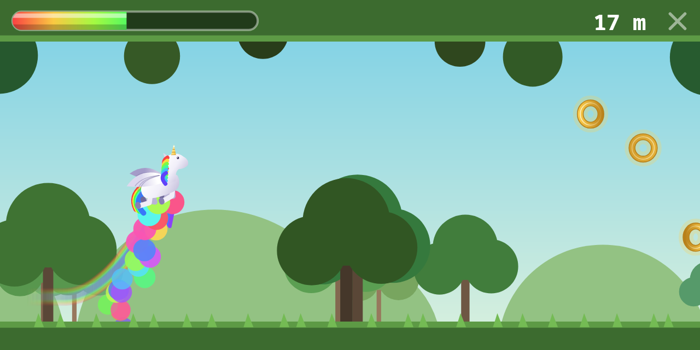 | 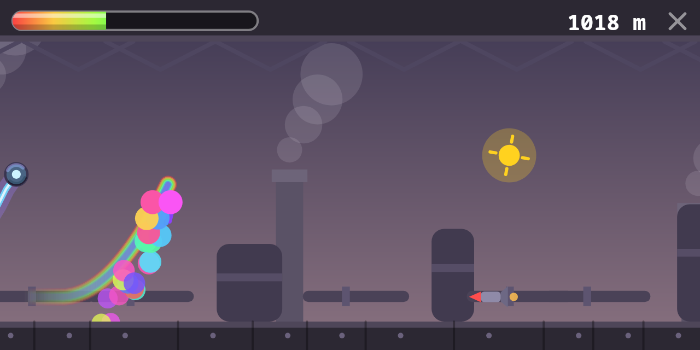 | 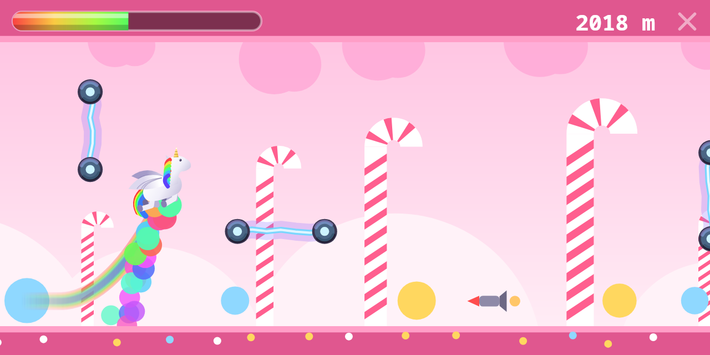 |
| **Seabed** | **Desert** | **City** |
| 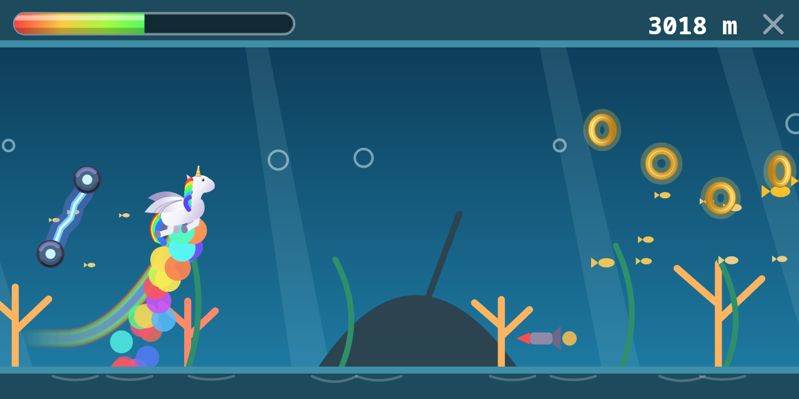 | 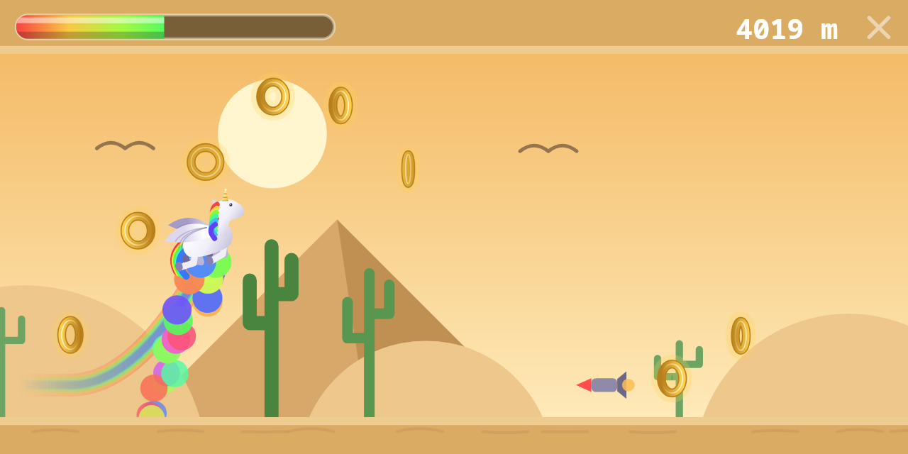 | 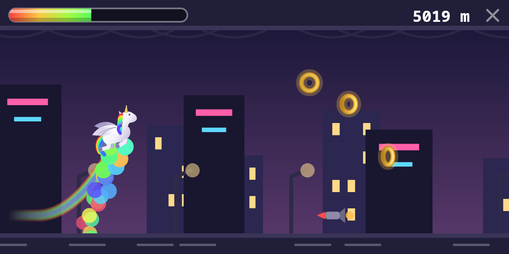 |
| **Icefield** | **Jungle** | **Beach** |
| 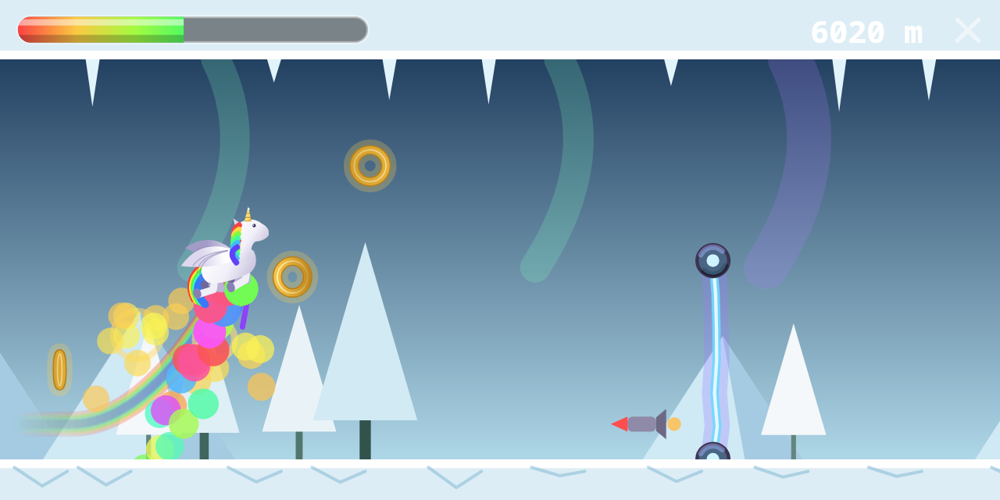 | 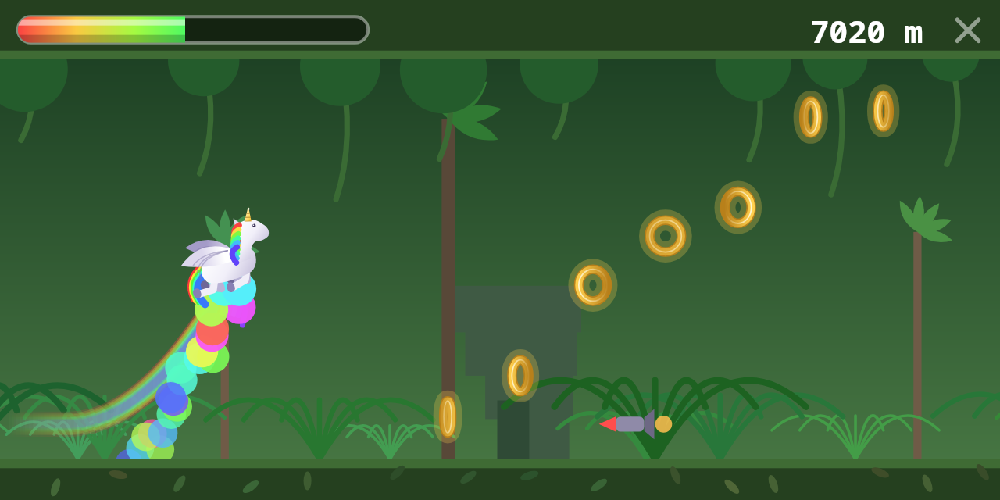 | 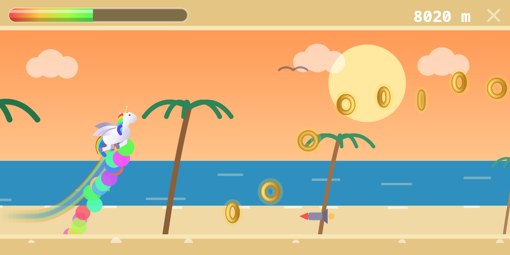 |
| **Volcano** | **Neon Grid** | **Orbital Station** |
| 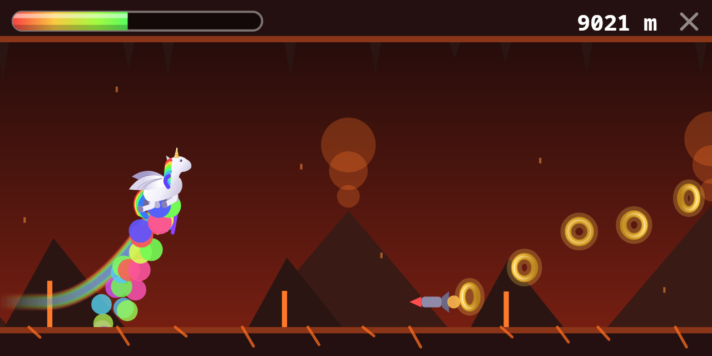 | 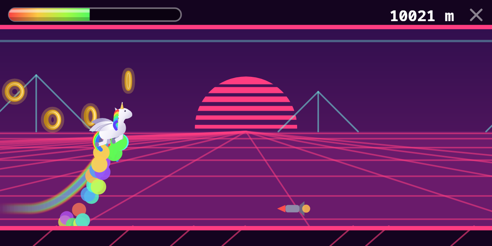 | 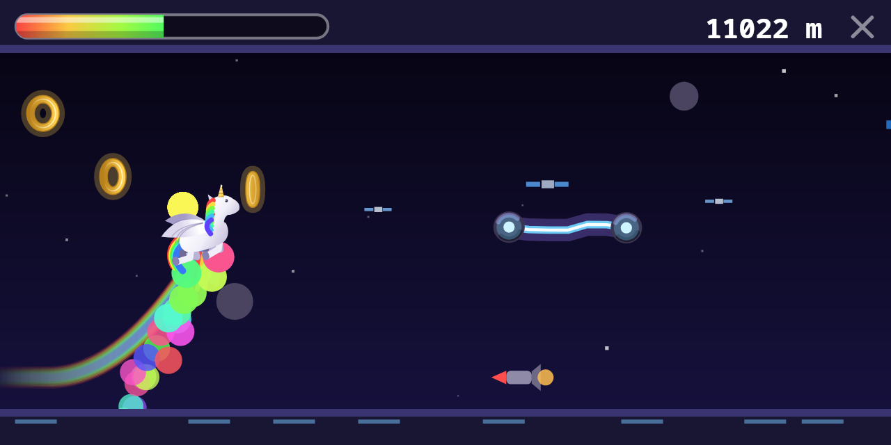 |

## This repository

`index.html` is the source — readable, commented, unminified. It is the file to
read, and it runs as-is: open it in a browser and the game starts.

The submitted package is the same file put through a build chain that strips the
comments and the indentation, wraps the body in `with(C)` so every canvas call
loses its prefix, shortens each global name to one or two characters, then hands
the result to terser, [Roadroller](https://github.com/lifthrasiir/roadroller) and
[ECT](https://github.com/fhanau/Efficient-Compression-Tool). Nothing else
differs: no code is added or removed along the way.

## How the music is stored

One arrangement per world, packed into a single string:

```
tempo | swing | chords | bass | arpeggio | melody | kick | snare | hat | voices
```

A chord is one letter whose character code carries the root in MIDI, lower case
for a minor chord. In a pattern a digit or letter is a degree of the chord, a
dash holds the note before it, and a dot is a rest. Patterns may run over several
bars, which is what stops the loop from being heard. The sixth and the seventh
degrees are derived from the chord's third, so major and minor share one table.

## Licence

MIT — see `LICENSE`.
